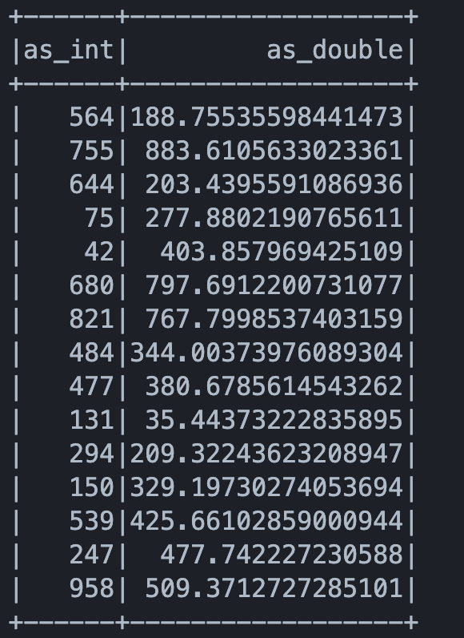

# PySpark + UCOSS

Example containing a small PySpark application that configures the integration with Unity Catalog OSS to query a delta table.

The repo provides a Docker image that for show & tell purpose contains the unity catalog server along with a PySpark app for those in the Python ecosystem. 

## Build and run with docker compose

```bash
docker compose up -d --build  
```

## Run pyspark app

```bash
docker exec ucoss python /opt/app/app.py
```

## Result

The example app queries the built-in `numbers` table. You should see this as output.


# Unity Catalog OSS CLI
You can use the `cli` to interact with Unity Catalog APIs to crud catalogs, schemas, tables, etc.

Have a look at some examples in the [official repo.](https://github.com/unitycatalog/unitycatalog?tab=readme-ov-file#operate-on-delta-tables-with-the-cli)
